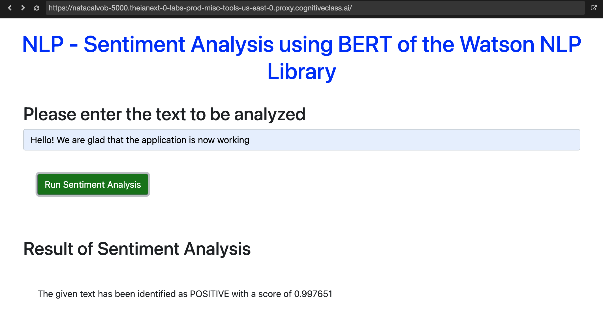

# AI-Based Sentiment Analysis Web Application

This project creates a web application that performs sentiment analysis on provided text using Watson AI libraries. The application was developed using the Flask framework to provide clear and concise results to the user through a Web Application. 

The AI-based sentiment Analysis Web Application allows users to input text and receive sentiment analysis results. The application utilizes Watson NLP (Natural Language Processing) library to analyze the sentiment of the provided text. It formats the output to display the sentiment label (e.g., positive, negative, neutral) and its confidence score. The application is deployed as a web application using Flask, ensuring easy accessibility for users. Error handling mechanisms are incorporated to handle unexpected situations gracefully. The project emphasizes code quality through static code analysis.

## Libraries Required:
- Watson NLP Library
- Flask
- Pylint

## Getting Started:
- Clone the project repository.
- Install the required libraries specified in requirements.txt.
- Follow the instructions provided in the project to set up and deploy the application.

## License:
This project is licensed under the MIT License - see the [LICENSE.md](LICENSE.md) file for details.

